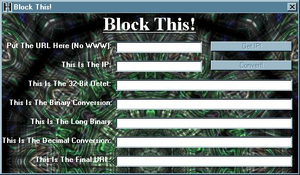



## Block This v2\.0

### Description

The purpose of Block This is to show off one of the many exploits available for poorly coded URL filtering applications/proxies. It is very easy to use and can help anyone who is interested in creating some form of URL blocking program.

In this new version of Block This (v2.0), the code is much smaller than it used to be. It also is easier for someone to understand if they wish to buils a similar application using my code as an example.

If you like this code and you can put it to good use, please vote for it. I spent a long time fixing this code up and nothing would make me feel better than to know that people can make use of it.

Special thanks to Adam Wechsler who was a big help in cleaning up the application!
 
### More Info
 

             |
---                |---
**Submitted On**   |2001-03-02 19:56:08
**By**             |[Christopher Streva](https://github.com/Planet-Source-Code/PSCIndex/blob/master/ByAuthor/christopher-streva.md)
**Level**          |Intermediate
**User Rating**    |4.8 (126 globes from 26 users)
**Compatibility**  |VB 6\.0
**Category**       |[Internet/ HTML](https://github.com/Planet-Source-Code/PSCIndex/blob/master/ByCategory/internet-html__1-34.md)
**World**          |[Visual Basic](https://github.com/Planet-Source-Code/PSCIndex/blob/master/ByWorld/visual-basic.md)
**Archive File**   |[CODE\_UPLOAD15731322001\.zip](https://github.com/Planet-Source-Code/christopher-streva-block-this-v2-0__1-21467/archive/master.zip)

